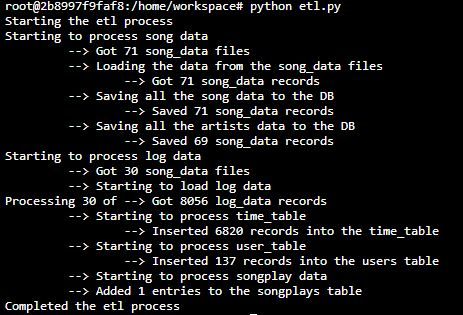
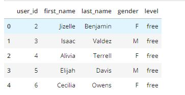

# Sparkify Analytics Project

## Introduction

This project was created for the Sparkify analytics team. Sparkify is a music streaming startup and the startup wants to analyze the data they've been collecting on songs and user activity on their new music streaming app. The Sparkify analytics team is particularly interested in understanding what songs users are listening to. They have user activity data that is in a directory of JSON logs and they don't have an easy way to query this data. In this project, an ETL script will be set-up to ingest the data into a Postgres Database.


## Requirements

Below is a list of requirements to run the scripts to process the data.

|                     | Version                      |
|---------------------|------------------------------|
| Python              | Python 3.6.3                 |
| Postgres Database   |                              |


## How to run the ETL scripts

From a computer with python installed, follow the steps below to run the ETL script.
1. Open terminal and navigate to the directory with the 'workspace' folder
2. Run the command below to run the ETL script

```

python etl.py

```

The output for running the above command is shown below:



## Description of the steps to process the data


#### 1. Data Sources

The data is stored in a directory shown in the image below. The data is in JSON format.


### 2. Processing the data

The 'etl.py' script takes the following steps to extract and load the data in the database.

- Drops any existing tables in the database
- Creates tables below in the database
- Extracts the long and log data in the JSON files
- Loads the extracted data in the created tables in the database. 


### 3. Database 

After the data is extracted from the JSON files, it is loaded into a Postgres database. The database will enable the analytics team to easily query the data and get insights from the data.

The schema of the database is a star schema. A star schema was adopted because the architecture has a FACT Table and Dimenson tables. The benneefit of this schema is that it is relatively simpler to understand and build. With a star schema, there is no need for complex joins when querying data which makes it faster to access data. With less joins it also makes it simpler to derive business insights.

Below are screenshots of the tables in the database

- SONGS TABLE


- ARTISTS TABLE


- USERS TABLE



- SONG_PLAYS TABLE


